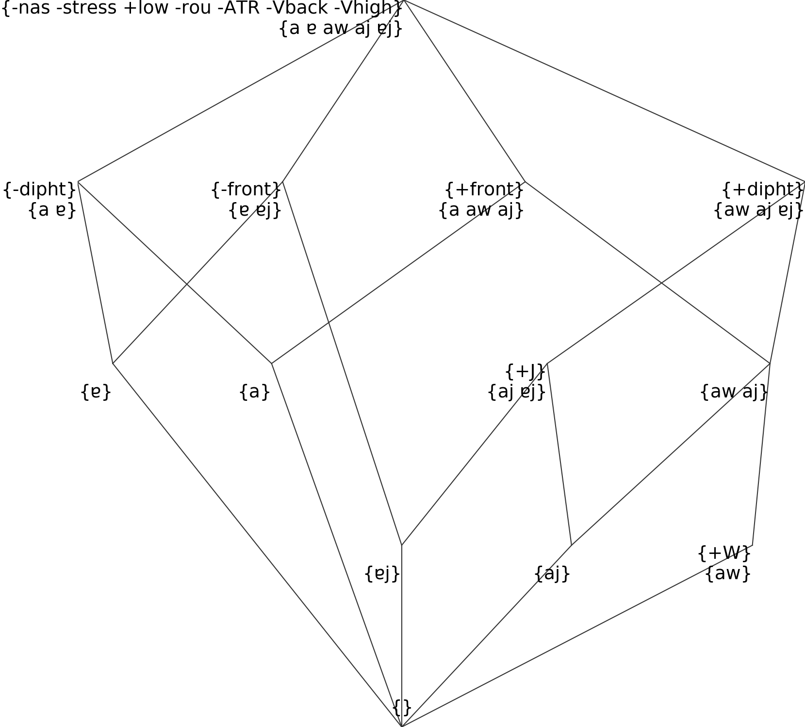

This tutorial describes how to prepare data for use in Qumin.

Preparing the data
==================

The scripts in Qumin expect full paradigmatic data in phonemic transcription, as well as a feature key for the transcription. Both are given as csv files.

The paradigms file
------------------

This files relates phonological forms to their lexemes and paradigm cells. As an example of valid data, Qumin is shipped with a paradigm table from the French inflectional lexicon `Flexique <http://www.llf.cnrs.fr/fr/flexique-fr.php>`__. Here is a sample of the first 10 columns for 10 randomly picked verbs from Flexique:

 =========== ================ ========= ========= ========= ========== ========== ========= ========== ========== ========== 
  lexeme      variants         prs.1sg   prs.2sg   prs.3sg   prs.1pl    prs.2pl    prs.3pl   ipfv.1sg   ipfv.2sg   ipfv.3sg  
 =========== ================ ========= ========= ========= ========== ========== ========= ========== ========== ========== 
  peler       peler            pɛl       pɛl       pɛl       pəlɔ̃       pəle       pɛl       pəlE       pəlE       pəlE      
  soudoyer    soudoyer         sudwa     sudwa     sudwa     sudwajɔ̃    sudwaje    sudwa     sudwajE    sudwajE    sudwajE   
  inféoder    inféoder         ɛ̃fEɔd     ɛ̃fEɔd     ɛ̃fEɔd     ɛ̃fEOdɔ̃     ɛ̃fEOde     ɛ̃fEɔd     ɛ̃fEOdE     ɛ̃fEOdE     ɛ̃fEOdE    
  débiller    débiller         dEbij     dEbij     dEbij     dEbijɔ̃     dEbije     dEbij     dEbijE     dEbijE     dEbijE    
  désigner    désigner         dEziɲ     dEziɲ     dEziɲ     dEziɲɔ̃     dEziɲe     dEziɲ     dEziɲE     dEziɲE     dEziɲE    
  crachoter   crachoter        kʁaʃɔt    kʁaʃɔt    kʁaʃɔt    kʁaʃOtɔ̃    kʁaʃOte    kʁaʃɔt    kʁaʃOtE    kʁaʃOtE    kʁaʃOtE   
  saouler     saouler:soûler   sul       sul       sul       sulɔ̃       sule       sul       sulE       sulE       sulE      
  caserner    caserner         kazɛʁn    kazɛʁn    kazɛʁn    kazɛʁnɔ̃    kazɛʁne    kazɛʁn    kazɛʁnE    kazɛʁnE    kazɛʁnE   
  parrainer   parrainer        paʁɛn     paʁɛn     paʁɛn     paʁEnɔ̃     paʁEne     paʁɛn     paʁEnE     paʁEnE     paʁEnE    
  souscrire   souscrire        suskʁi    suskʁi    suskʁi    suskʁivɔ̃   suskʁive   suskʁiv   suskʁivE   suskʁivE   suskʁivE  
 =========== ================ ========= ========= ========= ========== ========== ========= ========== ========== ========== 

Paradigm files are written in `wide format <https://en.wikipedia.org/wiki/Wide_and_narrow_data>`__:

-  each row represents a lexeme, and each column represents a cell.
-  The first column indicates a unique identifier for each lexeme. It is usually convenient to use orthographic citation forms for this purpose (e.g. infinitive for verbs).
-  In Vlexique, there is a second column with orthographic variants for lexeme names, which is called “variants”. You do not need to add a “variant” column, and if it is there, it will be ignored.
-  the very first row indicates the names of the cells as column headers. Columns headers shouldn’t contain the character “#”.

While Qumin assumes that inflected forms are written in some phonemic notation (we suggest to be as close to the IPA as possible), you do not need to explicitely segment them into phonemes in the paradigms file.

The file itself is a ``csv``, meaning that the values are written as plain text, in utf-8 format, separated by spaces. This format can be read by spreadsheet programs as well as programmatically:

.. code:: sh

   %%sh
   head -n 3 "../Data/Vlexique/vlexique-20171031.csv"

::

   lexeme,variants,prs.1sg,prs.2sg,prs.3sg,prs.1pl,prs.2pl,prs.3pl,ipfv.1sg,ipfv.2sg,ipfv.3sg,ipfv.1pl,ipfv.2pl,ipfv.3pl,fut.1sg,fut.2sg,fut.3sg,fut.1pl,fut.2pl,fut.3pl,cond.1sg,cond.2sg,cond.3sg,cond.1pl,cond.2pl,cond.3pl,sbjv.1sg,sbjv.2sg,sbjv.3sg,sbjv.1pl,sbjv.2pl,sbjv.3pl,pst.1sg,pst.2sg,pst.3sg,pst.1pl,pst.2pl,pst.3pl,pst.sbjv.1sg,pst.sbjv.2sg,pst.sbjv.3sg,pst.sbjv.1pl,pst.sbjv.2pl,pst.sbjv.3pl,imp.2sg,imp.1pl,imp.2pl,inf,prs.ptcp,pst.ptcp.m.sg,pst.ptcp.m.pl,pst.ptcp.f.sg,pst.ptcp.f.pl
   accroire,accroire,#DEF#,#DEF#,#DEF#,#DEF#,#DEF#,#DEF#,#DEF#,#DEF#,#DEF#,#DEF#,#DEF#,#DEF#,#DEF#,#DEF#,#DEF#,#DEF#,#DEF#,#DEF#,#DEF#,#DEF#,#DEF#,#DEF#,#DEF#,#DEF#,#DEF#,#DEF#,#DEF#,#DEF#,#DEF#,#DEF#,#DEF#,#DEF#,#DEF#,#DEF#,#DEF#,#DEF#,#DEF#,#DEF#,#DEF#,#DEF#,#DEF#,#DEF#,#DEF#,#DEF#,#DEF#,akʁwaʁ,#DEF#,#DEF#,#DEF#,#DEF#,#DEF#
   advenir,advenir,#DEF#,#DEF#,advjɛ̃,#DEF#,#DEF#,advjɛn,#DEF#,#DEF#,advənE,#DEF#,#DEF#,advənE,#DEF#,#DEF#,advjɛ̃dʁa,#DEF#,#DEF#,advjɛ̃dʁɔ̃,#DEF#,#DEF#,advjɛ̃dʁE,#DEF#,#DEF#,advjɛ̃dʁE,#DEF#,#DEF#,advjɛn,#DEF#,#DEF#,advjɛn,#DEF#,#DEF#,advɛ̃,#DEF#,#DEF#,advɛ̃ʁ,#DEF#,#DEF#,advɛ̃,#DEF#,#DEF#,advɛ̃s,#DEF#,#DEF#,#DEF#,advəniʁ,advənɑ̃,advəny,advəny,advəny,advəny

Overabundance
~~~~~~~~~~~~~

Inflectional paradigms sometimes have some overabundant forms, where the same lexeme and paradigm cell can be realized in various ways, as in “dreamed” vs “dreamt” for the English past of “to dream”. Concurrent forms can be written in the same cell, separated by “;”. Only some scripts can make use of this information, the other scripts will use the first value only. Here is an example for English verbs:

 =========== ==================== ========= ========== ======== ======== ============ ==================== ==================== 
  lexeme      ppart                pres3s    prespart   inf      pres1s   presothers   past13               pastnot13           
 =========== ==================== ========= ========== ======== ======== ============ ==================== ==================== 
  bind        baˑɪnd;baˑʊnd        baˑɪndz   baˑɪndɪŋ   baˑɪnd   baˑɪnd   baˑɪnd       baˑɪnd;baˑʊnd        baˑɪnd;baˑʊnd       
  wind(air)   waˑʊnd;waˑɪndɪd      waˑɪndz   waˑɪndɪŋ   waˑɪnd   waˑɪnd   waˑɪnd       waˑʊnd;waˑɪndɪd      waˑʊnd;waˑɪndɪd     
  weave       wəˑʊvn̩;wiːvd         wiːvz     wiːvɪŋ     wiːv     wiːv     wiːv         wəˑʊv;wiːvd          wəˑʊv;wiːvd         
  slink       slʌŋk;slæŋk;slɪŋkt   slɪŋks    slɪŋkɪŋ    slɪŋk    slɪŋk    slɪŋk        slʌŋk;slæŋk;slɪŋkt   slʌŋk;slæŋk;slɪŋkt  
  dream       driːmd               driːmz    driːmɪŋ    driːm    driːm    driːm        driːmd;drɛmt         driːmd;drɛmt     
 =========== ==================== ========= ========== ======== ======== ============ ==================== ====================    

Defectivity
~~~~~~~~~~~

On the contrary, some lexemes might be defective for some cells, and have no values whatsoever for these cells. The most explicit way to indicate these missing values is to write “#DEF#” in the cell. The cell can also be left empty. Note that some scripts ignore all lines with defective values.

Here are some examples from French verbs:

 ============== ========= ========= ========= ========= ========= ========= ========== ==========  
  lexeme         prs.1sg   prs.2sg   prs.3sg   prs.1pl   prs.2pl   prs.3pl   ipfv.1sg   ipfv.2sg  
 ============== ========= ========= ========= ========= ========= ========= ========== ========== 
  accroire       #DEF#     #DEF#     #DEF#     #DEF#     #DEF#     #DEF#     #DEF#      #DEF#     
  advenir        #DEF#     #DEF#     advjɛ̃     #DEF#     #DEF#     advjɛn    #DEF#      #DEF#     
  ardre          #DEF#     #DEF#     #DEF#     #DEF#     #DEF#     #DEF#     aʁdE       aʁdE      
  braire         #DEF#     #DEF#     bʁE       #DEF#     #DEF#     bʁE       #DEF#      #DEF#     
  chaloir        #DEF#     #DEF#     ʃo        #DEF#     #DEF#     #DEF#     #DEF#      #DEF#     
  comparoir      #DEF#     #DEF#     #DEF#     #DEF#     #DEF#     #DEF#     #DEF#      #DEF#     
  discontinuer   #DEF#     #DEF#     #DEF#     #DEF#     #DEF#     #DEF#     #DEF#      #DEF#     
  douer          #DEF#     #DEF#     #DEF#     #DEF#     #DEF#     #DEF#     #DEF#      #DEF#     
  échoir         #DEF#     #DEF#     eʃwa      #DEF#     #DEF#     #DEF#     #DEF#      #DEF#     
  endêver        #DEF#     #DEF#     #DEF#     #DEF#     #DEF#     #DEF#     #DEF#      #DEF#     
 ============== ========= ========= ========= ========= ========= ========= ========== ========== 

The phonological segments file
------------------------------

Qumin works from the assumption that your paradigms are written in phonemic notation. The phonological segments file provides a list of phonemes and their decomposition into distinctive features. This file is first used to segment the paradigms into sequences of phonemes (rather than sequences of characters). Then, the distinctive features are used to recognize phonological similarity and natural classes when creating and handling alternation patterns.

To create a new segments file, the best is usually to refer to an authoritative description, and adapt it to the needs of the specific dataset. In the absence of such a description, I suggest to make use of `Bruce Hayes’ spreadsheet <https://linguistics.ucla.edu/people/hayes/120a/index.htm#features>`__ as a starting point (he writes ``+``, ``-`` and ``0`` for our ``1``,\ ``0`` and ``-1``).

Format
~~~~~~

The segments file is also written in wide format, with each row describing a phoneme. The first column gives phonemes as they are written in the paradigms file. Each column represents a distinctive feature. Here is an example with just 10 rows of the segments table for French verbs:

 ====== ======== ============ =============== ========= ======= ====== ===== ========= ========= =========== ========= ======= ========== 
  Seg.   sonant   syllabique   consonantique   continu   nasal   haut   bas   arrière   arrondi   antérieur   CORONAL   voisé   rel.ret.  
 ====== ======== ============ =============== ========= ======= ====== ===== ========= ========= =========== ========= ======= ========== 
  p      0        0            1               0         0       0            0                   1                     0       0         
  b      0        0            1               0         0       0            0                   1                     1       0         
  t      0        0            1               0         0       0            0                   1           1         0       0         
  s      0        0            1               1         0       0            0                   1           1         0       1         
  i      1        1            0               1         0       1      0     0         0                               1       1         
  y      1        1            0               1         0       1      0     0         1                               1       1         
  u      1        1            0               1         0       1      0     1         1                               1       1         
  o      1        1            0               1         0       0            1         1                               1       1        
  a      1        1            0               1         0       0      1     1         0                               1       1         
  ɑ̃      1        1            0               1         1       0      1     1         0                               1       1      
 ====== ======== ============ =============== ========= ======= ====== ===== ========= ========= =========== ========= ======= ==========  

Some conventions:

-  The first column must be called ``Seg.``.
-  The phonological symbols, in the ``Seg.`` column cannot be one of the reserved character : ``. ^ $ * + ? { } [ ] / | ( ) < > _  ⇌ , ;``.
-  If the file contains a “value” column, it will be ignored. This is used to provide a human-readable description of segments, which can be useful when preparing the data.
-  In order to provide short names for the features, as in [+nas] rather than [+nasal], you can add a second level of header, also beginning by ``Seg.``, which gives abbreviated names:

 ====== ======== ============ =============== ========= ======= ====== ===== ========= ========= =========== ========= ======= ========== 
  Seg.   sonant   syllabique   consonantique   continu   nasal   haut   bas   arrière   arrondi   antérieur   CORONAL   voisé   rel.ret.  
 ====== ======== ============ =============== ========= ======= ====== ===== ========= ========= =========== ========= ======= ========== 
  Seg.   son      syl          cons            cont      nas     haut   bas   arr       rond      ant         COR       vois    rel.ret.  
  p      0        0            1               0         0       0            0                   1                     0       0         
  b      0        0            1               0         0       0            0                   1                     1       0        
 ====== ======== ============ =============== ========= ======= ====== ===== ========= ========= =========== ========= ======= ==========  

The file is encoded in utf-8 and can be either a csv table (preferred) or a tabulation separated table (tsv).

.. code:: sh

   %%sh
   head -n 6 "../Data/Vlexique/frenchipa.csv"

::

   Seg.,sonant,syllabique,consonantique,continu,nasal,haut,bas,arrière,arrondi,antérieur,CORONAL,voisé,rel.ret.
   Seg.,son,syl,cons,cont,nas,haut,bas,arr,rond,ant,COR,vois,rel.ret.
   p,0,0,1,0,0,0,,0,,1,,0,0
   b,0,0,1,0,0,0,,0,,1,,1,0
   t,0,0,1,0,0,0,,0,,1,1,0,0
   d,0,0,1,0,0,0,,0,,1,1,1,0

Segmentation and aliases
~~~~~~~~~~~~~~~~~~~~~~~~

Since the forms in the paradigms are not segmented into phonemes, the phonological segments file is used to segment them.

It is possible to specify phonemes which are more than one character long, for example using combining characters, or for diphthongs and affricates. Be careful of using the same notation as in your paradigms. For example, you can not use “a” + combining tilde in one, and the precomposed “ã” in the other file, as the program would not recognize them as the same thing. You should however be certain that there is no segmentation ambiguity. If you have sequences such as “ABC” which should be segmented “AB.C” in some contexts and “A.BC” in some other contexts, you need to change the notation in the paradigms file so that it is not ambiguous, for example by writing “A͡BC” in the first case and “AB͡C” in the second case. You would then have separate rows for “A”, “A͡B”, “C” and “B͡C” in the segments file.

Internally, the program will use arbitrary aliases which are 1 character long to replace longer phonemes – this substitution will be reversed in the output. While this usually works without your intervention, you can provide your own aliases if you want to preserve some readability in debug logs. This is done by adding a column “ALIAS” right after the fist column, which holds 1-char aliases. This example shows a few rows for the segment files of navajo:

 ====== ======= ========== ======= ====== ============= ========== ============ ================= === 
  Seg.   ALIAS   syllabic   htone   long   consonantal   sonorant   continuant   delayed release   …  
 ====== ======= ========== ======= ====== ============= ========== ============ ================= === 
  ɣ              0                  0      1             0          1            1                 …  
  k              0                  0      1             0          0            0                 …  
  k’     ḱ       0                  0      1             0          0            0                 …  
  k͡x     K       0                  0      1             0          0            1                 …  
  t              0                  0      1             0          0            0                 …  
  ť              0                  0      1             0          0            0                 …  
  t͡ɬ     L       0                  0      1             0          0            1                 …  
  t͡ɬ’    Ľ       0                  0      1             0          0            1                 …  
  t͡ɬʰ    Ḷ       0                  0      1             0          0            1                 …  
  ʦ              0                  0      1             0          0            1                 …  
  ʦ’     Ś       0                  0      1             0          0            1                 …  
  ʦʰ     Ṣ       0                  0      1             0          0            1                 …  
  ʧ      H       0                  0      1             0          0            1                 …  
  ʧ’     Ḣ       0                  0      1             0          0            1                 …  
  ʧʰ     Ḥ       0                  0      1             0          0            1                 …  
  t͡x     T       0                  0      1             0          0            1                 …  
  …      …       …          …       …      …             …          …            …                 …  
 ====== ======= ========== ======= ====== ============= ========== ============ ================= === 

If you have many multi-character phonemes, you may get the following error:

::

    ValueError: ('I can not guess a good one-char alias for ã, please use an ALIAS column to provide one.', 
                'occurred at index 41')

The solution is to add an alias for this character, and maybe a few others. To find aliases which vaguely resemble the proper symbols, this `table of unicode characters organized by letter <https://www.unicode.org/charts/collation/index.html>`__ are often useful.

Shorthands
~~~~~~~~~~~

When writing phonological rules, linguists often use shorthands like “V” for the natural class of all vowels, and “C” for the natural class of all consonants. If you want, you can provide some extra rows in the table to define shorthand names for some natural classes. These names have to start and end by “#”. Here an example for the French segments file, giving shorthands for C (consonants), V (vowels) and G (glides):

 ====== ======== ============ =============== ========= ======= ====== ===== ========= ========= =========== ========= ======= ========== 
  Seg.   sonant   syllabique   consonantique   continu   nasal   haut   bas   arrière   arrondi   antérieur   CORONAL   voisé   rel.ret.  
 ====== ======== ============ =============== ========= ======= ====== ===== ========= ========= =========== ========= ======= ========== 
  Seg.   son      syl          cons            cont      nas     haut   bas   arr       rond      ant         COR       vois    rel.ret.  
  #C#             0            1                                                                                                          
  #V#    1        1            0               1                                                                        1       1         
  #G#    1        0            0               1         0       1      0                         0                     1       1         
 ====== ======== ============ =============== ========= ======= ====== ===== ========= ========= =========== ========= ======= ========== 

Values of distinctive features
~~~~~~~~~~~~~~~~~~~~~~~~~~~~~~

Distinctive features are usually considered to be bivalent: they can be either positive ([+nasal]) or negative ([-nasal]). In the Segments file, positive values are written by the number ``1``, and negative values by the number ``0``. Some features do not apply at all to some phonemes, for example consonants are neither [+round] nor [-round]. This can be written either by ``-1``, or by leaving the cell empty. While the first is more explicit, leaving the cell empty makes the tables more readable at a glance. The same strategy is used for features which are privative, as for example [CORONAL]: there is no class of segments which are [-coronal], so we can write either ``1`` or ``-1`` in the corresponding column, not using ``0``. 

While ``1``, ``0`` and ``-1`` (or nothing) are the values that make the most sense, any numeric values are technically allowed, for example [-back], [+back] and [++back] could be expressed by writing ``0``, ``1``, and ``2`` in the "back" column. I do not recommend doing this.

When writing segments file, it is important to be careful of the naturality of natural classes, as Qumin will take them at face value. For example, using the same [±high] feature for both vowels and consonants will result in a natural class of all the [+high] segments, and one for all the [-high] segments. Sometimes, it is better to duplicate some columns to avoid generating unfounded classes. 

Monovalent or bivalent features
>>>>>>>>>>>>>>>>>>>>>>>>>>>>>>>>

`Frisch (1996) <https://www.cas.usf.edu/~frisch/publications.html>`__ argues that monovalent features (using only ``-1`` and ``1``) are to be preferred to bivalent features, as the latter implicitly generate natural classes for the complement features ([-coronal]), which is not always desirable. In Qumin, both monovalent and bivalent features are accepted. Internally, the program will expand all ``1`` and ``0``  into + and - values. As an example, take this table which classifies the three vowels /a/, /i/ and /u/:

.. csv-table::
   :file: segment_examples/V_monovalent.csv

Internally, Qumin will construct the following table, which looks almost identical because we used monovalued features:

===== ======= ===== ====== ======= ======= ===========
Seg.   +high  +low  +front  +back  +round   +Non-round
===== ======= ===== ====== ======= ======= ===========
a               x            x                x
i        x             x                      x
u        x                   x       x         
===== ======= ===== ====== ======= ======= ===========

This will then result in the following natural class hierarchy:

.. image:: segment_examples/V_monovalent.png
   :alt: Natural classes for three vowels

The same thing can be achieved with less columns using binary features:

.. csv-table::
   :file: segment_examples/V_binary.csv

Internally, these will be expanded to:

===== ======= ===== ====== ======= ======= ===========
Seg.   +high  -high +front  -front  +round   -round
===== ======= ===== ====== ======= ======= ===========
a               x            x                x
i        x             x                      x
u        x                   x       x         
===== ======= ===== ====== ======= ======= ===========

Which is the same thing as previously, with different names. The class hierarchy is also very similar:

.. image:: segment_examples/V_binary.png
   :alt: Natural classes for three vowels

Warning, some of the segments aren't actual leaves 
>>>>>>>>>>>>>>>>>>>>>>>>>>>>>>>>>>>>>>>>>>>>>>>>>>>

The following error occurs when the table is well formed, but specifies a natural class hierarchy which is not usable by Qumin:

::

     Exception: Warning, some of the segments aren't actual leaves :
        p is the same node as [p-kʷ]
            [p-kʷ] ([pĸ]) = [+cons -son -syll +lab -round -voice -cg -cont -strid -lat -del.rel -nas -long]
            kʷ (ĸ) = [+cons -son -syll +lab -round +dor +highC -lowC +back -tense -voice -cg -cont -strid -lat -del.rel -nas -long]
        k is the same node as [k-kʷ]
            [k-kʷ] ([kĸ]) = [+cons -son -syll +dor +highC -lowC +back -tense -voice -cg -cont -strid -lat -del.rel -nas -long]
            kʷ (ĸ) = [+cons -son -syll +lab -round +dor +highC -lowC +back -tense -voice -cg -cont -strid -lat -del.rel -nas -long]

What happened here is that the natural class [p-kʷ] has the exact same definition as just /p/. Similarly, the natural class [k-kʷ] has the same definition as /k/. The result is the following structure, in which /p/ and /k/ are superclasses of /kʷ/:

.. image:: segment_examples/error_C.png
   :alt: erroneous structure

In this structure, it is impossible to distinguish the natural classes [p-kʷ] and [k-kʷ] from the respective ponemes /p/ and /k/. Instead, we want them to be one level lower. If we ignore the bottom node, this means that they should be leaves of the hierarchy.

The solution is to ensure that both /p/ and /k/ have at least one feature divergent from [kʷ]. Usually, kʷ is marked as [+round], but in the above it is mistakenly written [-round]. Correcting this definitions yields the following structure, and solves the error:

.. image:: segment_examples/error_C_corrected.png
   :alt: erroneous structure

Neutralizations
>>>>>>>>>>>>>>>>

While having a segment be higher than another in the hierarchy is forbidden, it is possible to declare two segments with the exact same features. This is useful if you want to neutralize some oppositions, and ignore some details in the data.

For example, this set of French vowels display height oppositions using the [±low] feature:

.. csv-table::
   :file: segment_examples/french_no_neutralizations.csv

Leading to this complex hierarchy:

.. image:: segment_examples/french_no_neutralizations.png

Due to regional variations, the French Vlexique sometimes neutralizes this oppositions, and writes E, Ø and O to underspecify the value of the vowels. The solution is to neutralize entirely the [±low] distinction for these vowels, writing repeated rows for E, e, ɛ, etc:

.. csv-table::
   :file: segment_examples/french_neutralizations.csv

Internally, Qumin will replace all of these identical characters by a single unified one (the first in the file). The simplified structure becomes:

.. image:: segment_examples/french_neutralizations.png

Creating scales 
>>>>>>>>>>>>>>>>>

Rather than using many-valued features, it is often preferrable to use a few monovalent or bivalent features to create a scale. As an example, here is a possible (bad) implementation for tones, which uses a single feature "Tone". 

.. csv-table::
   :file: segment_examples/T_single_feature.csv

It results in this natural class hierarchy:

.. image:: segment_examples/T_single_feature.png
   :alt: four tone coded on a single feature

While such a file is allowed, it results in the tones having nothing in common. If some morpho-phonological alternations selects both high and mid tones, we will miss that generalization.

To express a scale, a simple solution is to create one less feature than there are segments (here four tones lead to three scale features), then fill in the upper diagonal with ``1`` and the lower diagonal with ``0`` (or the opposite). For example:

.. csv-table::
   :file: segment_examples/T_scale1.csv

It will result in the natural classes below:

.. image:: segment_examples/T_scale1.png
   :alt: tone scale 

Since this is not very readable, we can re-write the same thing in a more readable way using a combination of binary and monovalent features:

.. csv-table::
   :file: segment_examples/T_scale2.csv

Which leads to the same structure:

.. image:: segment_examples/T_scale2.png
   :alt: tone scale (more readable)

When implementing tones, I recommend to mark them all as [-segmental] to ensure that they share a common class, and to write all other features as [+segmental].

Diphthongs
>>>>>>>>>>>>

Diphthongs are not usually decomposed using distinctive features, as they are complex sequences (see `this question on the Linguist List <https://linguistlist.org/ask-ling/message-details1.cfm?asklingid=200408211>`__). However, if diphthongs alternate with simple vowels in your data, adding diphthongs in the list of phonological segments can allow Qumin to capture better generalizations. The strategy I have employed so far is the following:

- Write diphthongs in a non-ambiguous way in the data (either 'aj' or 'aˑi', but not 'ai' when the same sequence can sometimes be two vowels)
- Copy the features from the initial vowel
- Add a monovalent feature [DIPHTHONG]
- Add monovalent features [DIPHTHONG_J],  [DIPHTHONG_W], etc, as needed.

This is a small example for a few English diphthongs:

.. csv-table::
   :file: segment_examples/en_V.csv

Which leads to the following classes:

.. image:: segment_examples/en_V.png
   :alt: Small sample from English diphthongs

This example describes a few European Portuguese diphthongs:

.. csv-table::
   :file: segment_examples/por_V_diph.csv 

with the following resulting classes:

Others
>>>>>>>>>>>>

- Stress: I recommend to mark it directly on vowels, and duplicate the vowel inventory to have both stressed and unstressed counterpart. A simple binary [±stress] feature is enough to distinguish them.
- Length: Similarly, I recommend to mark length, when possible, on vowels, rather than duplicating them.
- Neutralizations: It i