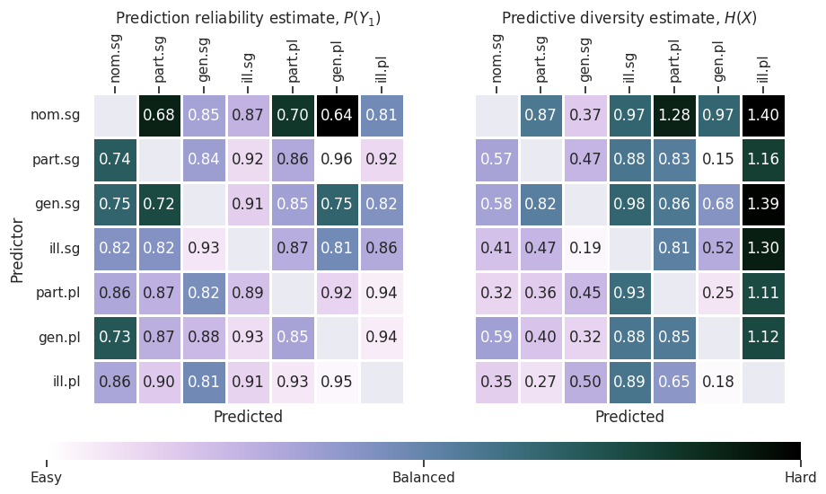

Visualizing results
===================

Since Qumin 2.0, results are shipped as long tables. This allows to store several metrics in the same file, with results for several runs. As a drawback, it becomes harder to get an idea of the results.

A script reads these files and displays the results as heatmaps. So far, it only works for simple one predictor computations, but it also handles overabundant situations: ::

    /$ qumin action=ent_heatmap ent_hm.results=<entropies.csv>

The script takes advantage of the Paralex `features-values` table to sort the cells in a canonical order to display the heatmap. The `ent_hm.order` setting is used to specify which feature should have higher priority in the sorting: ::

    /$ qumin action=ent_heatmap ent_hm.results=<entropies.csv> ent_hm.order="[number, case]"

Enabling the density option ``ent_hm.dense`` will simply shorten the labels. The ``ent_hm.annotate`` option will display annotations on the heatmap (i.e. the value for each pair of cells).

    Example of heatmap for overabundant paradigms produced with the following code: ::

    /$ qumin action=ent_heatmap ent_hm.results=<entropies.csv> ent_hm.order="[number, case]" ent_hm.annotate=True
