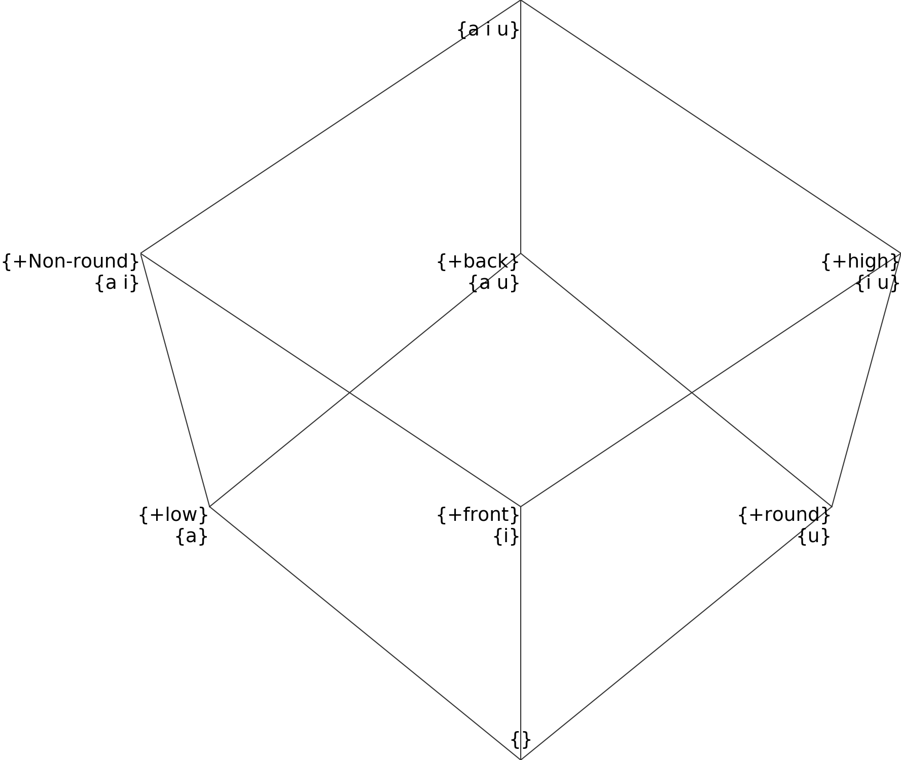
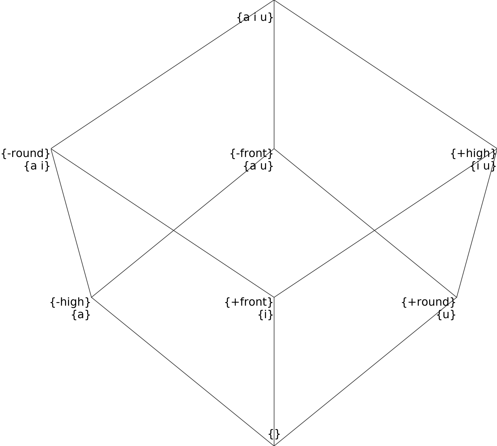
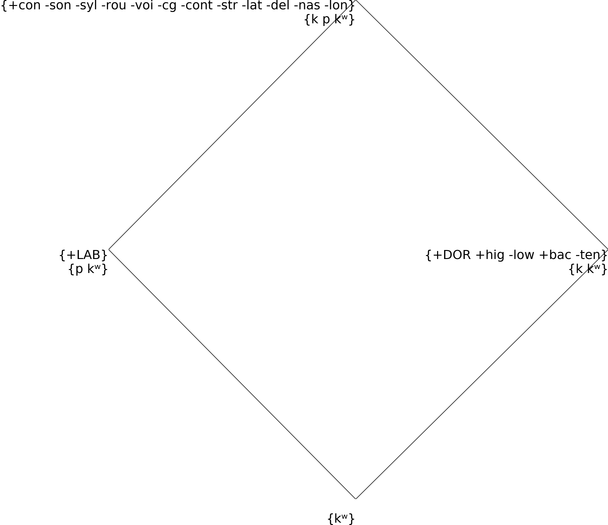
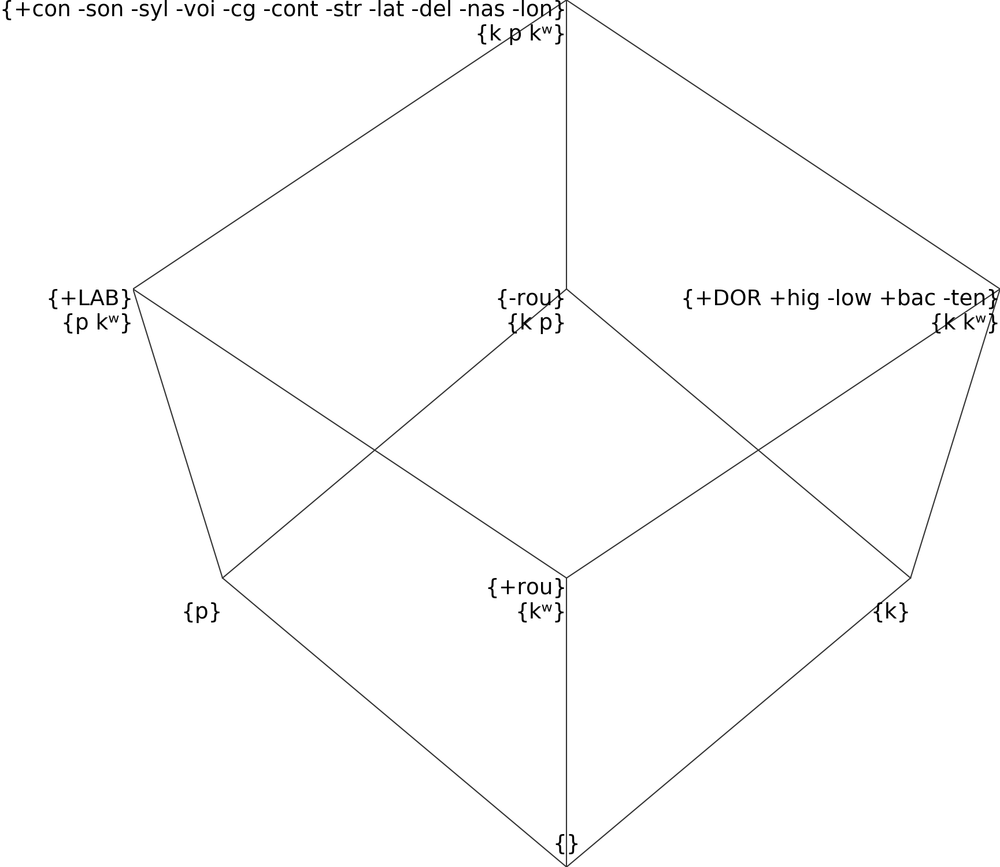
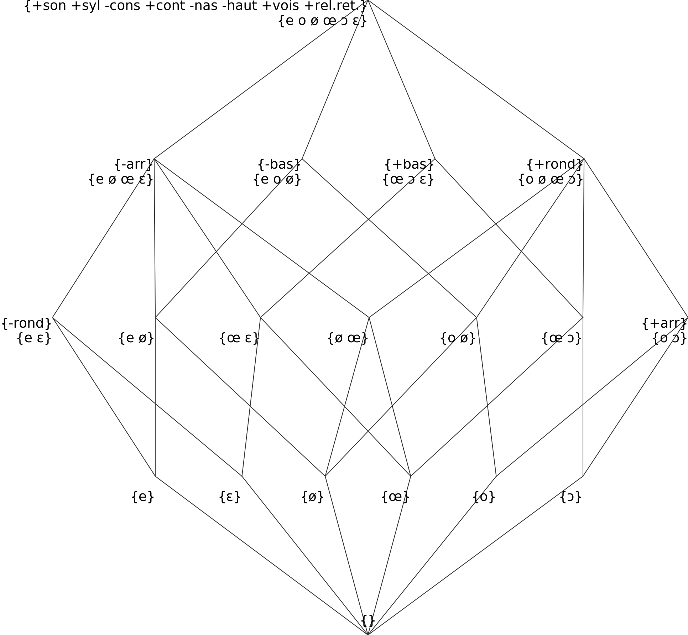
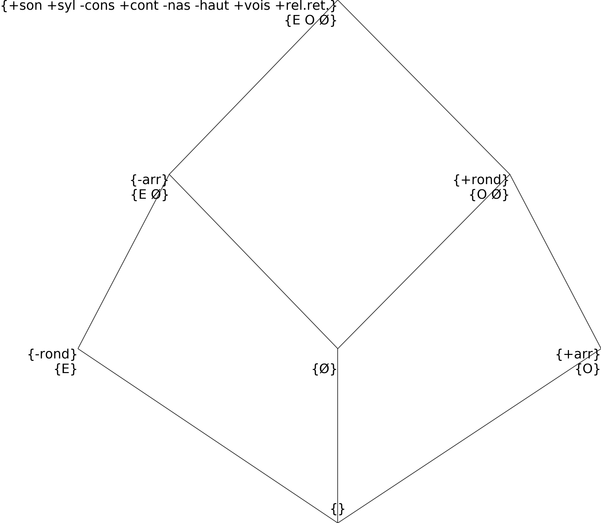
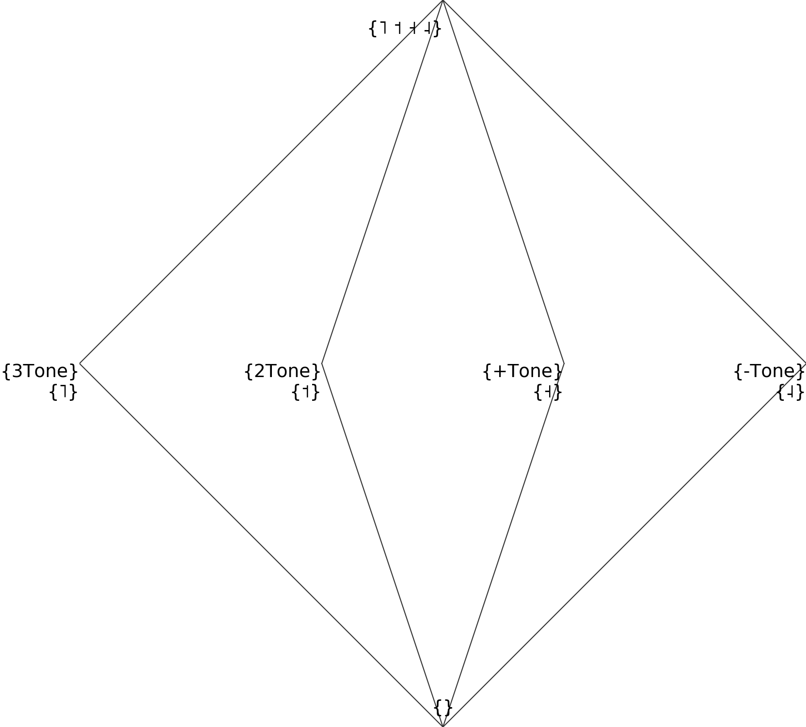
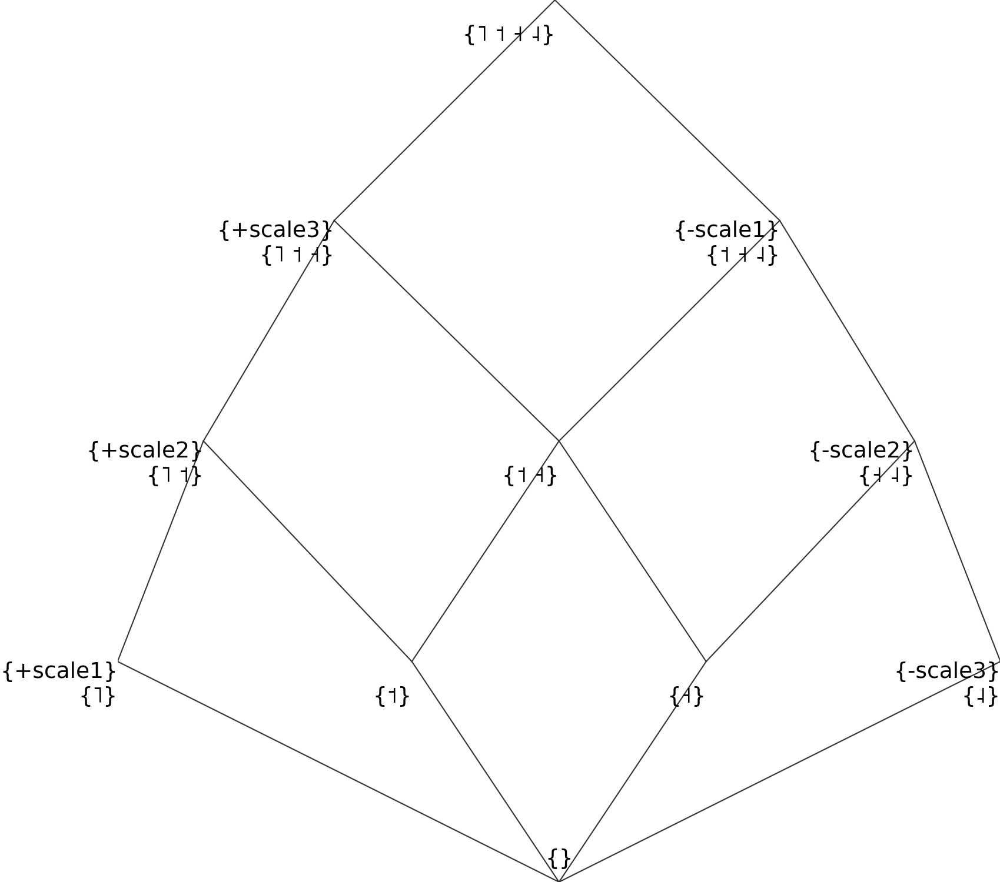
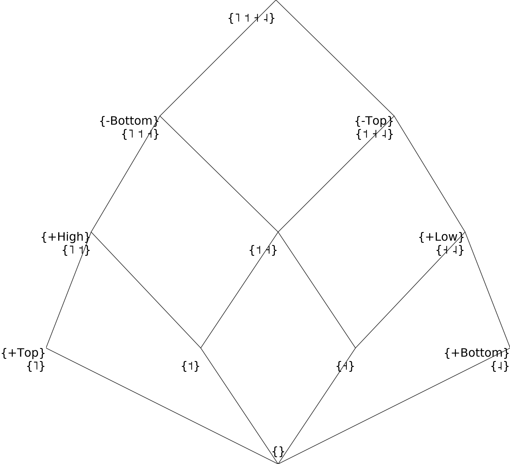

The phonological segments file
================================

Qumin works from the assumption that your paradigms are written in phonemic notation. The phonological segments file provides a list of phonemes and their decomposition into distinctive features. This file is first used to segment the paradigms into sequences of phonemes (rather than sequences of characters). Then, the distinctive features are used to recognize phonological similarity and natural classes when creating and handling alternation patterns.

To create a new segments file, the best is usually to refer to an authoritative description, and adapt it to the needs of the specific dataset. In the absence of such a description, I suggest to make use of `Bruce Hayes’ spreadsheet <https://linguistics.ucla.edu/people/hayes/120a/index.htm#features>`__ as a starting point (he writes ``+``, ``-`` and ``0`` for our ``1``,\ ``0`` and ``-1``).

Format
~~~~~~

Each row of the segments file describes a single phoneme. The first column gives phonemes as they are written in the paradigms file. Each column represents a distinctive feature. Here is an example with just 10 rows of the segments table for French verbs:

.. warning::
    The index header used to be `Seg.` (for segment). This is deprecated, and Qumin now expects `sound_id`, per the Paralex standard.

.. warning::
    The columns `ALIAS`, `UNICODE` and `value` are all also deprecated

 ========== ======== ============ =============== ========= ======= ====== ===== ========= ========= =========== ========= ======= ==========
  sound_id   sonant   syllabique   consonantique   continu   nasal   haut   bas   arrière   arrondi   antérieur   CORONAL   voisé   rel.ret.
 ========== ======== ============ =============== ========= ======= ====== ===== ========= ========= =========== ========= ======= ==========
  p          0        0            1               0         0       0            0                   1                     0       0
  b          0        0            1               0         0       0            0                   1                     1       0
  t          0        0            1               0         0       0            0                   1           1         0       0
  s          0        0            1               1         0       0            0                   1           1         0       1
  i          1        1            0               1         0       1      0     0         0                               1       1
  y          1        1            0               1         0       1      0     0         1                               1       1
  u          1        1            0               1         0       1      0     1         1                               1       1
  o          1        1            0               1         0       0            1         1                               1       1
  a          1        1            0               1         0       0      1     1         0                               1       1
  ɑ̃          1        1            0               1         1       0      1     1         0                               1       1
 ========== ======== ============ =============== ========= ======= ====== ===== ========= ========= =========== ========= ======= ==========

Some conventions:

-  The first column must be called ``sound_id``.
-  The phonological symbols, in the ``sound_id`` column cannot be one of he reserved character : ``. ^ $ * + ? { } [ ] / | ( ) < > _  ⇌ , ;``.

 ========== ======== ============ =============== ========= ======= ====== ===== ========= ========= =========== ========= ======= ==========
  sound_id   sonant   syllabique   consonantique   continu   nasal   haut   bas   arrière   arrondi   antérieur   CORONAL   voisé   rel.ret.
 ========== ======== ============ =============== ========= ======= ====== ===== ========= ========= =========== ========= ======= ==========
  p          0        0            1               0         0       0            0                   1                     0       0
  b          0        0            1               0         0       0            0                   1                     1       0
 ========== ======== ============ =============== ========= ======= ====== ===== ========= ========= =========== ========= ======= ==========

The file is encoded in utf-8 and can be either a csv table (preferred) or a tabulation separated table (tsv).

.. code:: sh

   %%sh
   head -n 6 "../Data/Vlexique/frenchipa.csv"

::

   sound_id,sonant,syllabique,consonantique,continu,nasal,haut,bas,arrière,arrondi,antérieur,CORONAL,voisé,rel.ret.
   p,0,0,1,0,0,0,,0,,1,,0,0
   b,0,0,1,0,0,0,,0,,1,,1,0
   t,0,0,1,0,0,0,,0,,1,1,0,0
   d,0,0,1,0,0,0,,0,,1,1,1,0

Segmentation and aliases
~~~~~~~~~~~~~~~~~~~~~~~~

Inflected forms are now expected to be segmented in the input (using spaces to separate phonemes in words).
The ALIAS column is not needed anymore.

Shorthands
~~~~~~~~~~~

Qumin used to support a second header row to provide distinctive feature shorthands. These are not supported anymore.

One can provide some extra rows in the table to define shorthand names for some natural classes. These names have to start and end by “#”. Here an example for the French segments file, giving shorthands for C (consonants), V (vowels) and G (glides):

 ========== ======== ============ =============== ========= ======= ====== ===== ========= ========= =========== ========= ======= ==========
 sound_id   sonant   syllabique   consonantique   continu   nasal   haut   bas   arrière   arrondi   antérieur   CORONAL   voisé   rel.ret.
 ========== ======== ============ =============== ========= ======= ====== ===== ========= ========= =========== ========= ======= ==========
  #C#                   0            1
  #V#          1        1            0               1                                                                        1       1
  #G#          1        0            0               1         0       1      0                         0                     1       1
 ========== ======== ============ =============== ========= ======= ====== ===== ========= ========= =========== ========= ======= ==========

Values of distinctive features
~~~~~~~~~~~~~~~~~~~~~~~~~~~~~~

Distinctive features are usually considered to be bivalent: they can be either positive ([+nasal]) or negative ([-nasal]). In the Segments file, positive values are written by the number ``1``, and negative values by the number ``0``. Some features do not apply at all to some phonemes, for example consonants are neither [+round] nor [-round]. This can be written either by ``-1``, or by leaving the cell empty. While the first is more explicit, leaving the cell empty makes the tables more readable at a glance. The same strategy is used for features which are privative, as for example [CORONAL]: there is no class of segments which are [-coronal], so we can write either ``1`` or ``-1`` in the corresponding column, not using ``0``. 

While ``1``, ``0`` and ``-1`` (or nothing) are the values that make the most sense, any numeric values are technically allowed, for example [-back], [+back] and [++back] could be expressed by writing ``0``, ``1``, and ``2`` in the "back" column. I do not recommend doing this.

When writing segments file, it is important to be careful of the naturality of natural classes, as Qumin will take them at face value. For example, using the same [±high] feature for both vowels and consonants will result in a natural class of all the [+high] segments, and one for all the [-high] segments. Sometimes, it is better to duplicate some columns to avoid generating unfounded classes. 

Monovalent or bivalent features
>>>>>>>>>>>>>>>>>>>>>>>>>>>>>>>>

`Frisch (1996) <http://www.cas.usf.edu/~frisch/publications.html>`__ argues that monovalent features (using only ``-1`` and ``1``) are to be preferred to bivalent features, as the latter implicitly generate natural classes for the complement features ([-coronal]), which is not always desirable. In Qumin, both monovalent and bivalent features are accepted. Internally, the program will expand all ``1`` and ``0``  into + and - values. As an example, take this table which classifies the three vowels /a/, /i/ and /u/:

.. csv-table::
   :file: segment_examples/V_monovalent.csv

Internally, Qumin will construct the following table, which looks almost identical because we used monovalued features:

 ========== ======= ===== ====== ======= ======= ===========
 sound_id   +high   +low  +front  +back  +round   +Non-round
 ========== ======= ===== ====== ======= ======= ===========
 a                    x            x                x
 i             x             x                      x
 u             x                   x       x
 ========== ======= ===== ====== ======= ======= ===========

This will then result in the following natural class hierarchy:

To visualize natural class hierarchies declared by segment files, you can use `FeatureViz <https://gitlab.com/sbeniamine/featureviz>`_.

The same thing can be achieved with less columns using binary features:

.. csv-table::
   :file: segment_examples/V_binary.csv

Internally, these will be expanded to:

========= ======= ===== ====== ======= ======= ===========
sound_id   +high  -high +front  -front  +round   -round
========= ======= ===== ====== ======= ======= ===========
a                   x            x                x
i            x             x                      x
u            x                   x       x
========= ======= ===== ====== ======= ======= ===========

Which is the same thing as previously, with different names. The class hierarchy is also very similar:

Warning, some of the segments aren't actual leaves 
>>>>>>>>>>>>>>>>>>>>>>>>>>>>>>>>>>>>>>>>>>>>>>>>>>>

The following error occurs when the table is well formed, but specifies a natural class hierarchy which is not usable by Qumin:

::

     Exception: Warning, some of the segments aren't actual leaves :
        p is the same node as [p-kʷ]
            [p-kʷ] ([pĸ]) = [+cons -son -syll +lab -round -voice -cg -cont -strid -lat -del.rel -nas -long]
            kʷ (ĸ) = [+cons -son -syll +lab -round +dor +highC -lowC +back -tense -voice -cg -cont -strid -lat -del.rel -nas -long]
        k is the same node as [k-kʷ]
            [k-kʷ] ([kĸ]) = [+cons -son -syll +dor +highC -lowC +back -tense -voice -cg -cont -strid -lat -del.rel -nas -long]
            kʷ (ĸ) = [+cons -son -syll +lab -round +dor +highC -lowC +back -tense -voice -cg -cont -strid -lat -del.rel -nas -long]

What happened here is that the natural class [p-kʷ] has the exact same definition as just /p/. Similarly, the natural class [k-kʷ] has the same definition as /k/. The result is the following structure, in which /p/ and /k/ are superclasses of /kʷ/:

In this structure, it is impossible to distinguish the natural classes [p-kʷ] and [k-kʷ] from the respective ponemes /p/ and /k/. Instead, we want them to be one level lower. If we ignore the bottom node, this means that they should be leaves of the hierarchy.

The solution is to ensure that both /p/ and /k/ have at least one feature divergent from [kʷ]. Usually, kʷ is marked as [+round], but in the above it is mistakenly written [-round]. Correcting this definitions yields the following structure, and solves the error:

Neutralizations
>>>>>>>>>>>>>>>>

While having a segment be higher than another in the hierarchy is forbidden, it is possible to declare two segments with the exact same features. This is useful if you want to neutralize some oppositions, and ignore some details in the data.

For example, this set of French vowels display height oppositions using the [±low] feature:

.. csv-table::
   :file: segment_examples/french_no_neutralizations.csv
   :header-rows: 2
   :stub-columns: 1 

Leading to this complex hierarchy:

Due to regional variations, the French Vlexique sometimes neutralizes this oppositions, and writes E, Ø and O to underspecify the value of the vowels. The solution is to neutralize entirely the [±low] distinction for these vowels, writing repeated rows for E, e, ɛ, etc:

.. csv-table::
   :file: segment_examples/french_neutralizations.csv
   :header-rows: 2
   :stub-columns: 1 

Internally, Qumin will replace all of these identical characters by a single unified one (the first in the file). The simplified structure becomes:

Creating scales 
>>>>>>>>>>>>>>>>>

Rather than using many-valued features, it is often preferrable to use a few monovalent or bivalent features to create a scale. As an example, here is a possible (bad) implementation for tones, which uses a single feature "Tone". 

.. csv-table::
   :file: segment_examples/T_single_feature.csv
   :header-rows: 2
   :stub-columns: 1 

It results in this natural class hierarchy:

While such a file is allowed, it results in the tones having nothing in common. If some morpho-phonological alternations selects both high and mid tones, we will miss that generalization.

To express a scale, a simple solution is to create one less feature than there are segments (here four tones lead to three scale features), then fill in the upper diagonal with ``1`` and the lower diagonal with ``0`` (or the opposite). For example:

.. csv-table::
   :file: segment_examples/T_scale1.csv
   :header-rows: 2
   :stub-columns: 1 

It will result in the natural classes below:

Since this is not very readable, we can re-write the same thing in a more readable way using a combination of binary and monovalent features:

.. csv-table::
   :file: segment_examples/T_scale2.csv
   :header-rows: 2
   :stub-columns: 1 

Which leads to the same structure:

When implementing tones, I recommend to mark them all as [-segmental] to ensure that they share a common class, and to write all other features as [+segmental].

Diphthongs
>>>>>>>>>>>>

Diphthongs are not usually decomposed using distinctive features, as they are complex sequences (see `this question on the Linguist List <https://linguistlist.org/ask-ling/message-details1.cfm?asklingid=200408211>`__). However, if diphthongs alternate with simple vowels in your data, adding diphthongs in the list of phonological segments can allow Qumin to capture better generalizations. The strategy I have employed so far is the following:

- Write diphthongs in a non-ambiguous way in the data (either 'aj' or 'aˑi', but not 'ai' when the same sequence can sometimes be two vowels)
- Copy the features from the initial vowel
- Add a monovalent feature [DIPHTHONG]
- Add monovalent features [DIPHTHONG_J],  [DIPHTHONG_W], etc, as needed.

This is a small example for a few English diphthongs:

.. csv-table::
   :file: segment_examples/en_V.csv
   :header-rows: 2
   :stub-columns: 1 

Which leads to the following classes:

.. image:: segment_examples/en_V.png
   :alt: Small sample from English diphthongs

Others
>>>>>>>>>>>>

- Stress: I recommend to mark it directly on vowels, and duplicate the vowel inventory to have both stressed and unstressed counterpart. A simple binary [±stress] feature is enough to distinguish them.
- Length: Similarly, I recommend to mark length, when possible, on vowels, rather than duplicating them.
